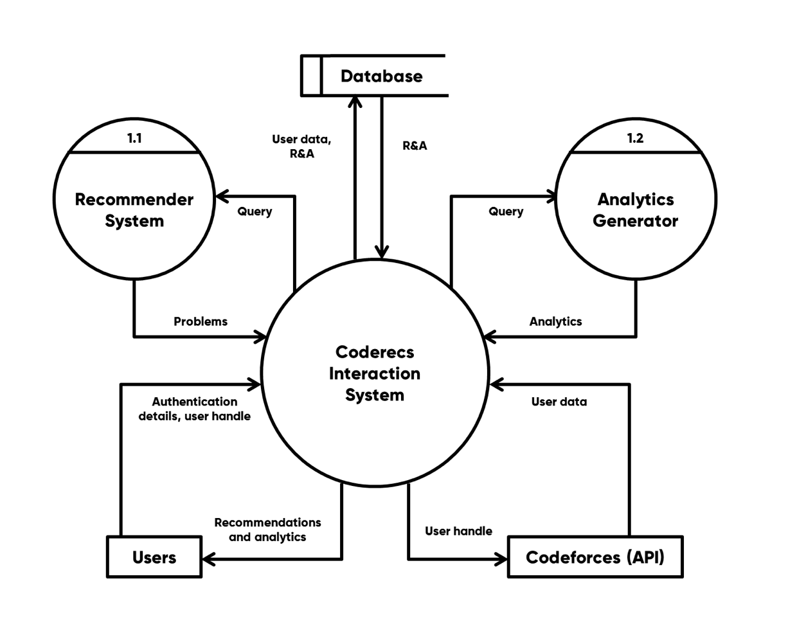

<h1>Coderecs</h1>
<h2> Software Engineering Project </h2>

| Team Member            | SID      |
|------------------------|----------|
| Abhinav Rawal          | 20103008 |
| Uttam Mittal           | 20103056 |
| Harasees Singh         | 20103074 |
| Harshpreet Singh Johar | 20103076 |

---

## The problem we aim to solve

Competitive Programming is a mind sport that gained popularity around 10 years ago. It involves tricky mathematical puzzles that require the amalgamation of algorithms, number theory and general logic to solve. It has a huge community which grows every year with college freshers entering the realm of coding from around the world. The most important factor that decides the leaderboard in programming contests is the ability to think out of the box. This is built over time with persistent practice.

However, all beginners face a common problem:
**Which questions to practice and in which order ?**

---

## The solution we aim to build

Our solution will work by recommending problems to our users based on their codeforces profile. The solution will consist of two parts: a web application and a Deep Learning Model responsible for the problem recommendation engine. The solution will be deeply integrated with the codeforces profile of the user. Since codeforces is the most reputed site for competitive programming, our solution will recommend problems directly from the codeforces problemset based on the type of problems the user has solved in the past and the type of problems similarly rated programmers have solved. ‘Rating’, provided by codeforces, is a measure of the proficiency of a programmer in competitive programming and is generally an accurate measure for the same. Fetching the user data, which must be fed into the deep learning model, will be readily available using the various APIs provided by codeforces.com.

---

## Walkthrough

Once the user signs up on our website, we will be extracting his/her details from codeforces and feeding it to the problem recommendation engine hosted on a remote server. Once the recommendations are ready they will be communicated to our frontend and displayed on the user’s dashboard. We plan to provide 10 problem recommendations to our users and update them every 24 hours.

---

## Why will our solution work ?

We plan on tweaking our deep learning model in a way such that it follows the most widely used technique of practicing called **Upsolving**. In general beginners aren’t able to decide on the difficulty level they should solve to maximize their learning rate. Our solution tackles this problem by providing the users with problems of various difficulties and from various topics filtered according to their specific profile. This shall not only improve the learning rate of our users but also help avoid unnecessary intimidation caused by tackling problems too tough for the present level of a programmer. Thus our website will be a one-stop solution for all competitive programmers who are aiming to improve but don’t know what problems to solve.

---

## Coderecs system design

Our system ensures simplicity at all levels of the design. With our interaction system users can get access to their contest and practice analytics along with multiple recommendations based on their performance. The interaction system is coupled with two dedicated sub-systems viz the recommender and the analytics generator.

---

